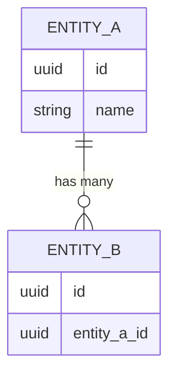

# Example domain — Data model

> **Note:** This is a placeholder file. Replace with the real data model when this domain is defined.

## Entity template

```
### [EntityName]

| Field | Type | Required | Description |
|-------|------|----------|-------------|
| id    | UUID | Yes      | Primary key |
```

## Relationships

> *(Use an ERD Mermaid diagram to show relationships between entities.)*



## Defined entities

> *(Add entities here.)*
