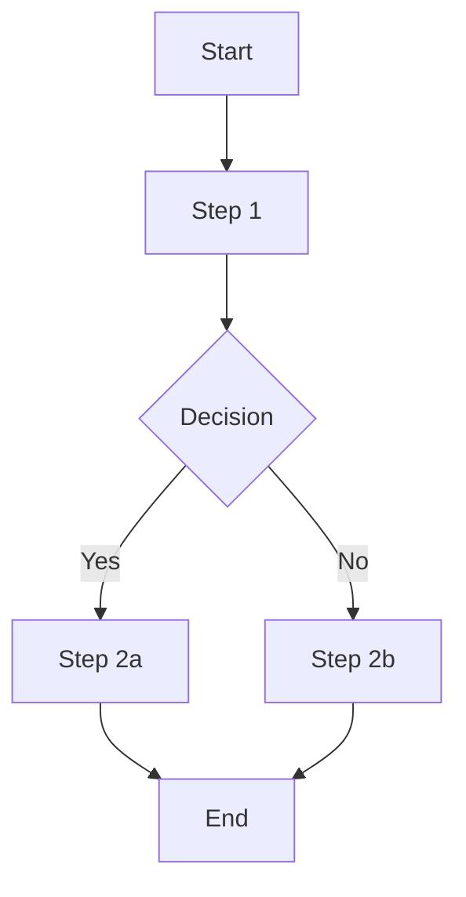

# Example domain — Workflows

> **Note:** This is a placeholder file. Replace with real workflows when this domain is defined.

## Workflow template

Use Mermaid diagrams to illustrate workflows where possible.

## Defined workflows

> *(Add workflows here.)*
