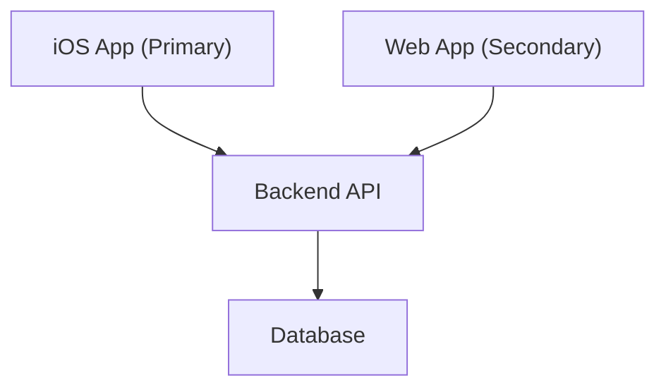

# System overview

## Architecture style

> *(Describe the high-level architecture style — e.g., client-server, event-driven, monolith.)*

## High-level diagram

## Components

| Component | Responsibility | Platform |
|-----------|---------------|----------|
| iOS App | Primary user interface | iOS |
| Web App | Secondary user interface | Web |
| Backend API | Business logic and data access | Server |
| Database | Persistent storage | Server |

## Key decisions

> *(Summarise the most important architectural decisions. Link to the relevant ADRs in `/brain/06-decisions/adr/`.)*
