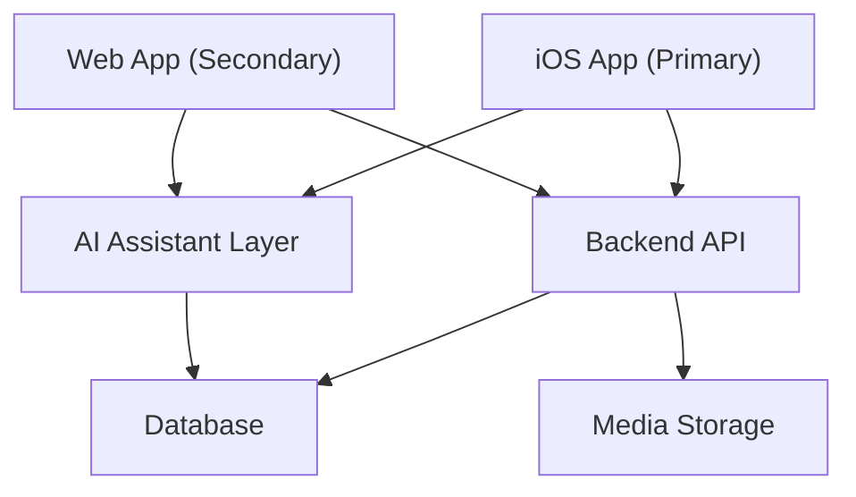

# Architecture

## Architecture Style

RipEm uses a client-server architecture with a mobile-first client (iOS) and a cloud-hosted backend API. An AI assistant layer sits between the client and backend, providing context-aware responses.

## High-Level Diagram

## Components

| Component | Responsibility | Platform |
|-----------|---------------|----------|
| iOS App | Primary user interface; voice capture; build logging | iOS |
| Web App | Secondary interface; build discovery; read-only primarily | Web |
| Backend API | Business logic, data access, auth | Server |
| AI Assistant Layer | Transcription, extraction, Q&A, content generation | Server/Cloud |
| Database | Persistent storage for users, builds, sessions, parts | Server |
| Media Storage | Photos, audio recordings, generated video content | Cloud |

## Key Architectural Decisions

1. **iOS First**: All features designed and validated on iOS before web consideration
2. **AI as a Layer**: AI is not embedded in the client — it's a service layer the client calls
3. **Offline-Capable Logging**: Voice capture works offline; sync happens when connectivity is restored
4. **Watermark at Publish**: Watermark is applied server-side at publish time, not client-side

## See Also

- [tech_stack.md](./tech_stack.md)
- [api_spec.md](./api_spec.md)
- [infrastructure.md](./infrastructure.md)
