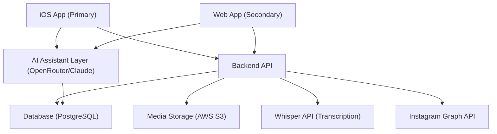

# Architecture

## Architecture Style

RiPeM uses a client-server architecture with a mobile-first client (iOS) and a cloud-hosted backend API. An AI assistant layer sits between the client and backend, providing context-aware responses built on the user's "Garage Brain" (their full project history).

## High-Level Diagram



## Components

| Component | Responsibility | Platform |
|-----------|---------------|----------|
| iOS App | Primary user interface; voice capture; build logging | iOS (SwiftUI) |
| Web App | Secondary interface; build discovery; read-only primarily | Web (React/TypeScript) |
| Backend API | Business logic, data access, auth, AI orchestration | Server |
| AI Assistant Layer | Transcription, context-aware responses, caption generation | Server/Cloud |
| Database | Persistent storage (users, projects, logs, conversations) | PostgreSQL |
| Media Storage | Photos, audio recordings | AWS S3 |
| Instagram API | OAuth + publishing + watermark tracking | Cloud |

## Key Architectural Decisions

1. **iOS First**: All features designed and validated on iOS before web consideration
2. **AI as a Layer**: AI is not embedded in the client — it's a service layer the client calls
3. **Offline-Capable Logging**: Voice capture works offline; sync happens when connectivity is restored
4. **Watermark at Publish**: Watermark is applied server-side at publish time
5. **Async AI Responses**: MVP uses async (not real-time) AI responses; real-time is premium stretch goal
6. **Data-as-Moat**: Every log entry trains future proprietary model

## Phased Launch Architecture

### Phase 1 — Weeks 1-4: Onboarding + AI Garage Brain
- iOS app + onboarding questionnaire flow
- Garage knowledge base creation (garage brain)
- First AI interaction (the "Dale moment")
- Voice recording capability (stored locally, no transcription yet)

### Phase 2 — Weeks 5-6: AI Voice Logging + Responses
- Whisper transcription integration
- Voice → Transcription → AI Response pipeline
- Async chat responses with push notifications
- Offline sync capability

### Phase 3 — Weeks 7-8: Instagram + Discovery Feed
- Instagram auto-publishing with AI-generated captions
- Watermark with tracking URL
- Discovery feed (browse other garages)
- Subscription management (iOS In-App Purchase)

## Voice → Transcription → AI Response Pipeline

```
User records voice → App stores locally (offline-first)
                  ↓ User goes online
            Sync triggers
                  ↓
        Send audio to Whisper API
                  ↓
        Receive transcript
                  ↓
        Build LLM context:
        - System prompt (Car Buddy personality)
        - Project metadata (year, make, model, story, skill level)
        - Questionnaire data
        - Last 5 log entries
        - Last 10 conversation messages
                  ↓
        Send to OpenRouter (Claude)
                  ↓
        Store in log_entries + ai_conversations + ai_token_usage
                  ↓
        Push notification: "Your buddy has responded"
```

## Discovery Feed Algorithm (V1)

```
For each user, show builds where:
  30% — subscribed garages (people they follow)
  30% — similar car type (year/make/model)
  25% — similar project type (track_car, restoration, etc.)
  15% — trending / serendipitous

Ranking: newer entries rank higher; more likes/shares rank higher
```

## Instagram Integration

```
User taps "Share" → AI generates caption → User approves
  → POST to Instagram Graph API
  → Watermark: "ripem.app/dale?src=instagram&utm=..."
  → Track watermark_clicks in instagram_posts table
```

Watermark drives new user acquisition: others see post → click watermark → discover RiPeM.

## Subscription Model

| Tier | Price | Key Features |
|------|-------|--------------|
| Free | $0 | 1 project, async AI, voice logging, discovery feed, Instagram sharing (with watermark), ads |
| Chat Pro | $5-7/mo | Everything free + real-time voice chat, ad-free |
| Projects Add-on | $2/mo each | Extra projects beyond free tier |
| Shop | $20-50/mo | Unlimited projects, multi-user workspace, premium support, no ads |

## Security Requirements (MVP)

- HTTPS only
- OAuth tokens stored securely (Keychain on iOS)
- Passwords hashed (bcrypt)
- S3 presigned URLs for uploads (no direct bucket access)
- Rate limiting on all API endpoints
- GDPR-compliant soft delete
- User data public by default unless toggled private

## Known Unknowns

1. Offline sync conflict resolution (user edits locally, AI responds simultaneously)
2. Optimal "garage brain" structure for fast LLM context inclusion
3. Token cost management if free users log heavily
4. Instagram API approval timeline
5. Discovery feed algorithm effectiveness — iterate with real data

## See Also

- [tech_stack.md](./tech_stack.md)
- [api_spec.md](./api_spec.md)
- [data_model.md](./data_model.md)
- [ios_architecture.md](./ios_architecture.md)
- [infrastructure.md](./infrastructure.md)
